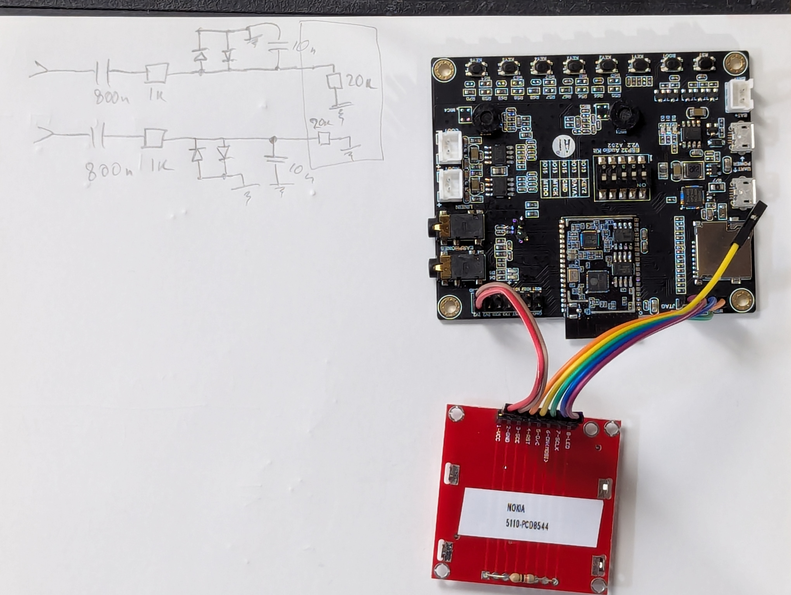
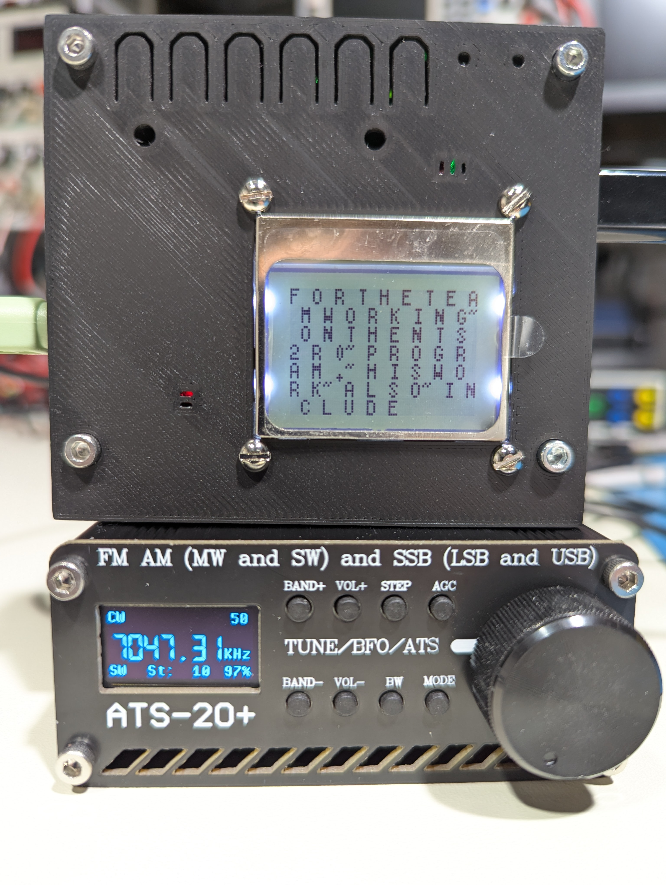

# esp-adf-esp32-a1s-morse-decode

Decodes morse code from an audio signal using [ESP32 A1S](https://github.com/johnradford49/ESP32-Audio-Kit/blob/main/esp32-audio-kit_v2.2_sch.pdf).

ES8388 config: LineIn -> PGA(ALC) -> ADC -> I2S -> ESP32 DSP -> I2S -> DAC -> LineOut.

DSP: BPF(750Hz) -> Envelope detector -> LPF -> Rescaling -> Audio out / OOK edge detector -> Morse decoder

`esp-adf-a686ff2ba4d9658c77845be0de2b423d9ee22324.patch` captures some of the changes to ESP ADF lyrat_v4_3 board, for reference,
in the end all of the registers are configured directly.

Display: PCD8544, attached to JTAG header, see [lcd.c](main/lcd.c). Dip switches 4,5 are ON.


## Build

Compiles with [esp-adf](https://docs.espressif.com/projects/esp-adf/en/latest/get-started/) `a686ff2ba4d9658c77845be0de2b423d9ee22324`.

``` sh
cp sdkconfig.defaults.esp32 sdkconfig
idf build flash monitor
```

Enclosure: [this model](https://www.printables.com/model/814645-esp32-audio-kit-v22-housing) with an LCD cut.

Line in mod (limiter/filter): 

Example session: 
